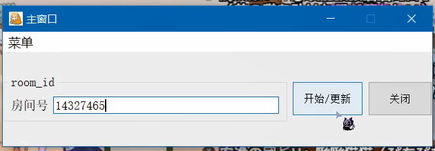
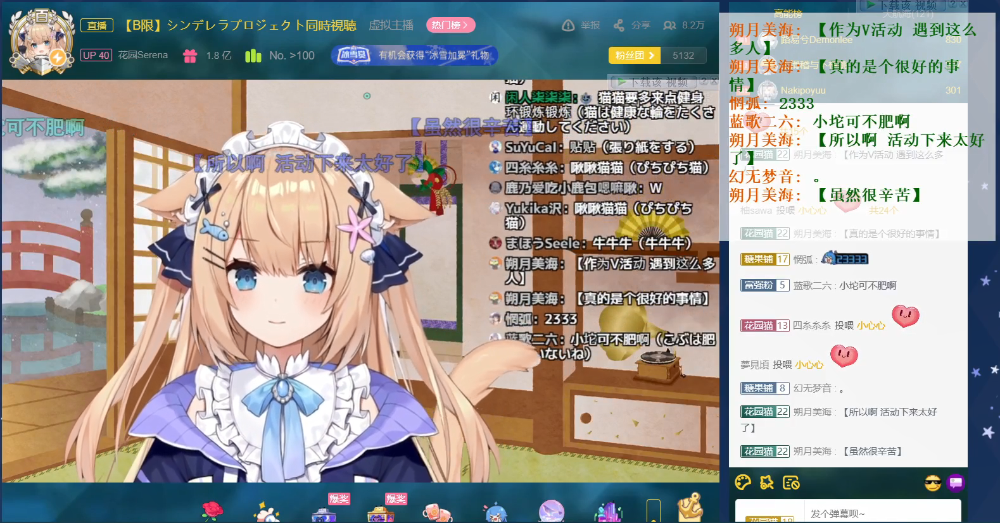
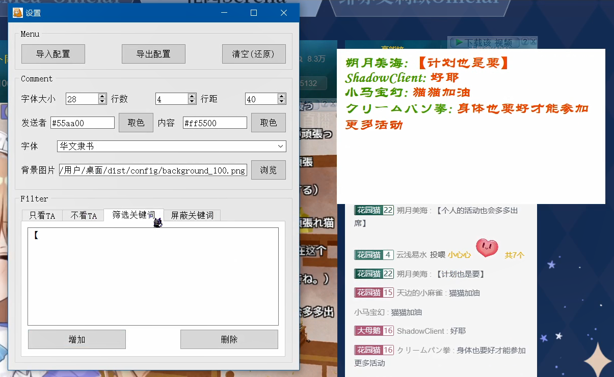

# B站直播弹幕姬

#### 介绍
应用python+websocket和pyqt5的bilibili直播弹幕。
支持修改窗口大小、透明度，弹幕大小、颜色、字体等。

#### 软件架构
- 前端使用pyqt5，后端使用python+websocket协议
- 作者只在window下测试过，其他平台请自行测试

#### 详情链接

1. 项目地址 
- B站视频教程：[https://www.bilibili.com/video/BV1LP4y177sa](https://www.bilibili.com/video/BV1LP4y177sa)
- gitee仓库：[https://gitee.com/huihui486/bilibili-danmuji](https://gitee.com/huihui486/bilibili-danmuji)
- github仓库：[https://github.com/huihui486/bilibili-danmuji](https://github.com/huihui486/bilibili-danmuji)
- CSDN博客：[https://blog.csdn.net/Sharp486/article/details/122516917](https://blog.csdn.net/Sharp486/article/details/122516917)

2. 个人主页
- gitee：[@huihui486](https://gitee.com/huihui486)
- github：[@huihui486](https://github.com/huihui486)
- CSDN：[@Sharp486](https://blog.csdn.net/Sharp486)

#### 使用说明

1. 直接运行start.py
2. 输入房间号，按下开始按钮
   
3. 效果图
   
4. 设置及效果图
   

